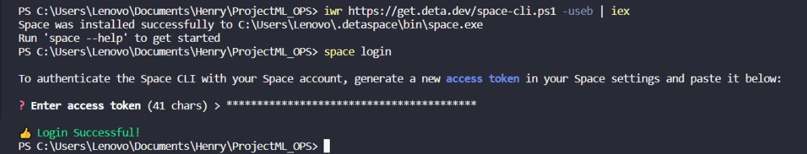

```fix
⚡⚡ Funcionamiento de la API. ⚡⚡
```
* En primer lugar, creamos una cuenta en https://deta.space/login?redirect_uri=https%3A%2F%2Fdeta.space%2F.
* Una vez verificados, accedemos con nuestras credenciales.
  
* Trabajamos en nuestro archivo main.py, donde creamos las funciones necesarias.
* Indicaciones:
```
Película con mayor duración con filtros opcionales de AÑO, PLATAFORMA Y TIPO DE DURACIÓN. (la función debe llamarse get_max_duration(year, platform, duration_type))

Cantidad de películas por plataforma con un puntaje mayor a XX en determinado año (la función debe llamarse get_score_count(platform, scored, year))

Cantidad de películas por plataforma con filtro de PLATAFORMA. (La función debe llamarse get_count_platform(platform))

Actor que más se repite según plataforma y año. (La función debe llamarse get_actor(platform, year))
```
* Empleamos FastAPI para crear nuestra API. (pip install fastapi)
* Las probamos localmente usando Uvicorn.  (pip install "uvicorn[standard]")
* Una vez probadas nuestras funciones localmente, deployamos nuestra API en deta space.
  


* Creamos el token de acceso en la plataforma de space build y lo copiamos.
* Una vez hecho esto, creamos un proyecto nuevo. 


* El siguiente paso es realizar el space push. Para esto debemos asegurar de estar en la ubicacion correcta con los archivos que queremos subir.
* Archivos necesarios para realizar el space push: main.py , requirements.txt, y el resto de información, como el dataset. 
* requirements.txt debe contener todas las librerías que hemos usado, incluyendo el fastAPI.
* ⚠️ IMPORTANTE ⚠️ Space llevaba pocos dias de haber sido lanzado, por lo que había problemas para subir los archivos. Tuve que subir los archivos main.py, requirements.txt solos primero.
* Cada vez que realicemos modificaciones o queramos subir un archivo, lo copiamos a la carpeta y realizamos el space push.
* Finalmente realizamos el space release, para habilitarlo al público.

```fix
⚡⚡  Prueba de la API. ⚡⚡
```
* Una vez hecho el release, en la terminal nos aparece la dirección url de nuestra API.

* ⚠️ IMPORTANTE ⚠️ Realizamos las pruebas en el navegador Google Chrome. Es importante no colocar caracteres extraños, tan solo letras y números.
  


* El enlace de mi api: https://deta.space/discovery/@caitcyan/my_api/exp-zXcY
* Enlaces de mis pruebas: 
* https://my_api-1-w0699410.deta.app
* https://my_api-1-w0699410.deta.app/get_score_count(netflix,3,2020)
* https://my_api-1-w0699410.deta.app/get_actor(disney,2019)
* https://my_api-1-w0699410.deta.app/get_count_platform(disney)
* https://my_api-1-w0699410.deta.app/get_max_duration(2020,netflix,min)
* https://my_api-1-w0699410.deta.app/get_max_duration()
  


