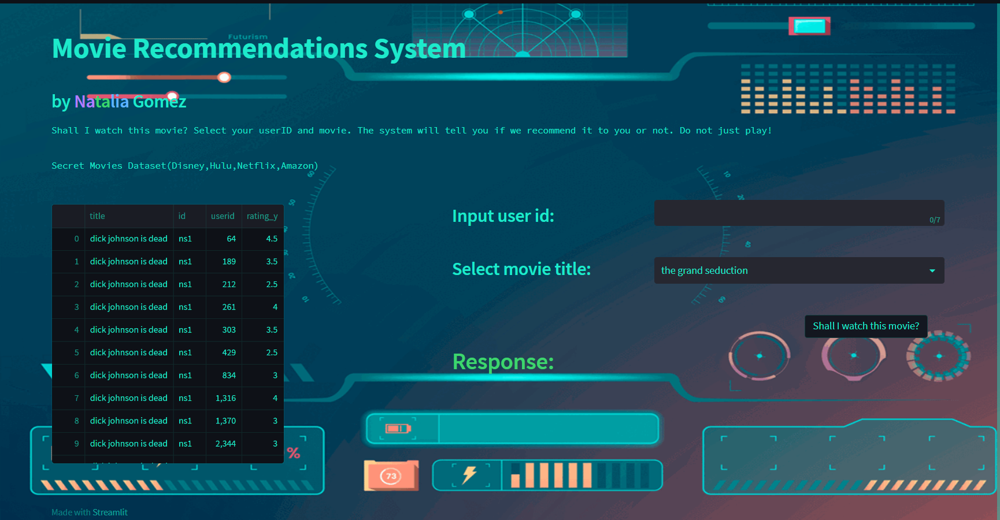

```fix
 ⚡⚡ Bienvenidos a mi primer proyecto individual ⚡⚡
```
Autora: <span style="color: violet;"> Na</span><span style="color: green;">ta</span><span style="color: cyan;">lia</span> Gomez

Video explicativo: [Video](http://example.com/ "Title")


Este proyecto consistió en limpiar, analizar brevemente y realizar un modelo de recomendación con un dataset de películas y series. 

Requisitos:
- Python 3.10.6 
- Microsoft Build tools 2014 o superior.
  
- Datos:
      https://drive.google.com/drive/folders/1b49OVFJpjPPA1noRBBi1hSmMThXmNzxn
    - Carpeta Data, con los cuatro csv de nuestros cuatro proveedores(netflix,amazon,disney,hulu).
    - Subcarpeta ratings, con los 8 archivos csv.
- Librerías: Pandas, Numpy, Space, Streamlit. # pip install

La carpeta del proyecto está estructurada de la siguiente manera:
> ProjectML_OPS
 - Data
 - ProjectML_OPS_ML
 - ProjectML_OPS_API
 - ETL.ipynb
 - EDA.ipynb
 - drive.py #Extra, para subir archivos al Drive

Dentro de ProjectML_OPS_ML tenemos la carpeta Streamlit, donde se encuentra la interfaz gráfica del sistema.

 - EDA_ML.ipynb
 - Streamlit

Dentro de Streamlit
- recommendations_movies.py
- background.gif
- overview.png
- upload_to_drive.py
- config.toml
- data.csv
- new_data.csv
- data_aux.csv

<span style="color: cyan;">Indicaciones para la ejecución del proyecto</span>

- Crear las carpetas necesarias.
- Ejecutar el notebook ETL.ipynb de la carpeta principal.
- Ejecutar el notebook EDA.ipynb de la carpeta principal.
- Deployar la API mediante Space, empleando la carpeta ProjectML_OPS_API.
- Ejecutar el notebook EDA_ML.ipynb, de la carpeta ProjectML_OPS_ML.
- Deployar la streamlitapp desde la carpeta Streamlit, con todo lo necesario para deployar. 
- Eso es todo!

✨IMPORTANTE✨: el archivo upload_to_drive.py es para subir mis datasets a Deta Drive.


```fix
Overview de la API
```
- Para saber cómo funciona la API dirigirse al readme.md ubicado en esa carpeta.

```fix
Overview de StreamlitApp
```
- La indicación consistió en crear un sistema de recomendación para saber si recomendar una pelicula o no a un usuario. 
  
 - Usé Streamlit para realizar la interfaz de la aplicación. 

 - Consideraciones:
 - Colocar el usuario Id en la caja de texto.
 - Elegir la película de la lista desplegable.
 - El sistema te indicará si te recomienda o no la película.



 - Eso es todo. Cualquier feedback es bienvenido. ✨✨✨
